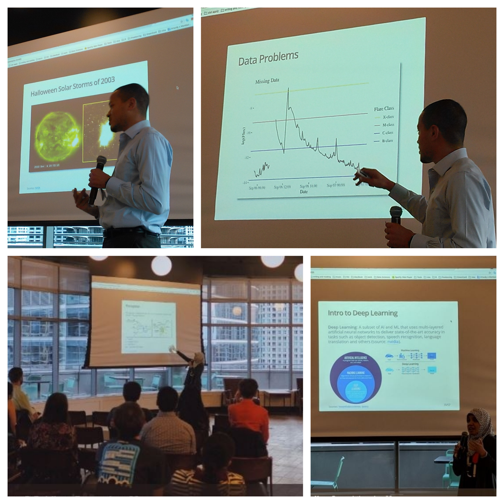
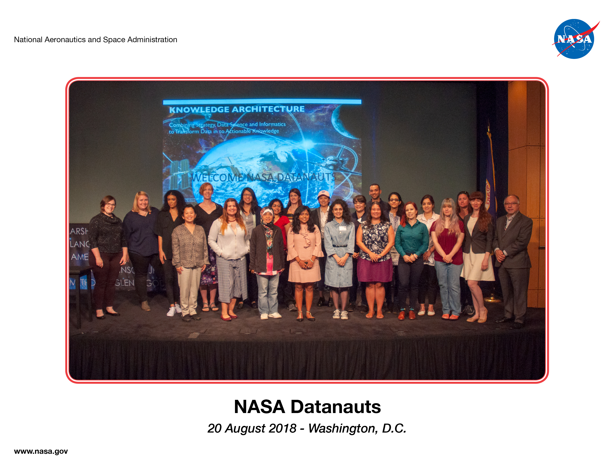

***

###August 28, 2018

The ASG Chicago members, Josh Goldberg and Caroline K. Williams gave a presentation, "Astrostatistics in R: Predicting Solar Flares" at R-Ladies Chicago meetup on August 28, 2018.  

***

###August 22, 2018

Founder of the ASG Chicago, Caroline K. Williams was accepted to the [Fall 2018 class of NASA Datanauts](https://open.nasa.gov/blog/welcome-fall-2018-class-nasa-datanauts/). She attended the kick-off event at NASA Headquarters in Washington DC on August 21-22, 2018 with fellow R-Ladies Board Member, Katherine Simeon. 

***

###April 9, 2018

It is an honor for the ASG Chicago to welcome Troy Hernandez from CRUG to serve as an advisor along with Kaelen L. Medeiros from R-Ladies Chicago. 

***

###March 8, 2018

The ASG officially starts to collaborate with Troy Hernandez from Chicago R User Group (CRUG) to work on his Solar Flare project. Please click [HERE](https://github.com/Chicago-R-User-Group/2017-n5-Meetup-SolarFlares) to learn more about the project.

***

###February 6, 2018

The ASG website is published on Github.

***

###January 28, 2018

The ASG website is created to consolidate all resources and to prepare a detailed project plan. 

***

###January 24, 2018

The initative to start ASG is introduced at R-Ladies Chicago social gathering. The responses from organizers and members are positive. Two members signed up to join the study group. Another member of R-Ladies Chicago signed up through the phone.

***
